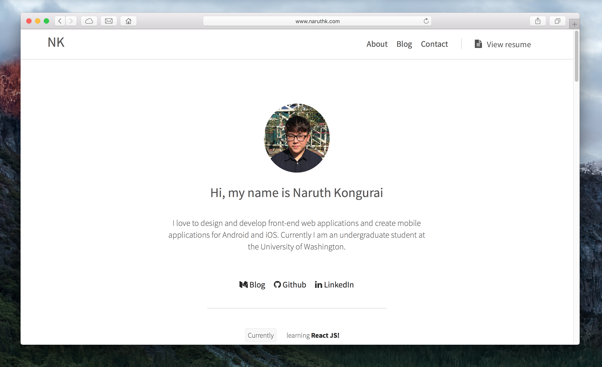

#  Official Website Source Code

The website is developed using React and *is not ejected* from the [Create React App](https://github.com/facebookincubator/create-react-app).

*Current website version*: 2.0

## Installation

- Have **npm** installed beforehand
- Do `git clone` of this repository
- Move into the directory of this recently cloned repository
- Type and run this command `npm install`
- Then, run `npm start` to start development server

## Libraries Used

- React: for fast, easy development
- Webpack: beats Gulp in everyway!

## Artworks

I obtained the permission to use the icons on my website from Flat Icons. The respective (and awesome creators) are Smashing Magazine, Freepik, and Vectors Market.

## License

Copyrighted 2017. MIT License. Please don't reproduce the source code of my website anywhere else. Thank you!